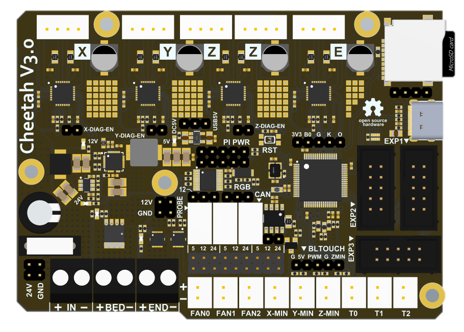

# Cheetah_V3.0

## 1. Introduction

The redesigned Cheetah uses a 180Mhz master controller to provide higher speed control. At the same time, in order to improve the ease of use, some commonly used interfaces are added, such as Bl-touch, CAN. At the same time, it provides a full 5V power supply to the Raspberry Pi or other SBCs on the small board, which makes it easier to use Klipper, and also retains the support of multiple voltage fans, which is very convenient.

### Change log：

1. The MCU changed : STM32F446RCT6 (180Mhz)

2. Add a reset button

3. Add CAN interface (with transceiver)

4. Add BL-Touch interface (IO multiplexing)

5. Increase the supply current of 5V to power the Raspberry Pi

6. Add 2x5 terminals for connecting to Raspberry Pi, including serial port 1 (PA9, PA10)

7. Each Pin on the back is marked with a definition silk screen

8. All IOs are redistributed, new configuration files are required, incompatible with V2 configurations

9. Remove EXP4

10. 4-layer PCB to improve EMC performance and heat dissipation

## 2. Feature

- Compact size: 101.5mm x 72mm，Compatible with the Creatlity ender 3/ender5 motherboard size

- **Fully integrated all in one solution:**

  - **STM32F446** MCU (Run Marlin 2.0/Klipper )

  - 4X TMC2209 stepper drivers, Support sensor-less homing

- **UNIVERSAL POWER:**

  - 24V to 12V/2A DC-DC for fans

  - Integrated high precision power regulators (DC/DC): **5V** **4****A** Max and 3.3V 800mA Max LDO，

  - 12V&24V power pin out

- Onboard TF card socket

- EXP3 for 12864 display panel (Creality 12864 panel or FYSETC Generic12864)

- EXP1&EXP2 RepRapDiscount SmartController compatible pin header on board

- Onboard 5V WS2812 RGB control

- **Onboard CANBUS Circuit**

- **5-Pin Bltouch Interface**（Share IO with Probe and Z-Min）

- SD card & USB upload support

- Car fuses（15A） for main power input

- Indicates all the name of PINS on the bottom

- Up to 3 ways PWM fans (5/12/24 Optional)

- Reliable PCB: **Four Layers**, TG155 FR4, Plug Hole, Immersion Gold
