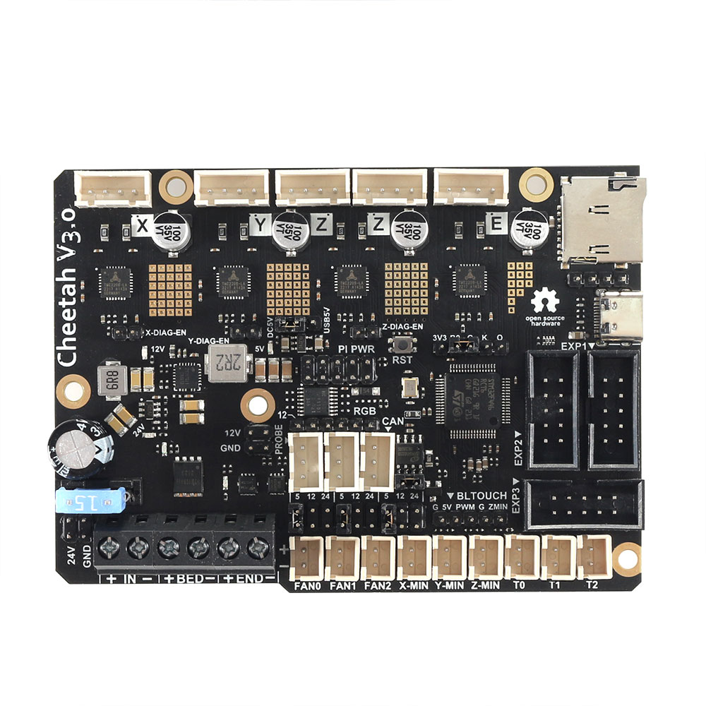
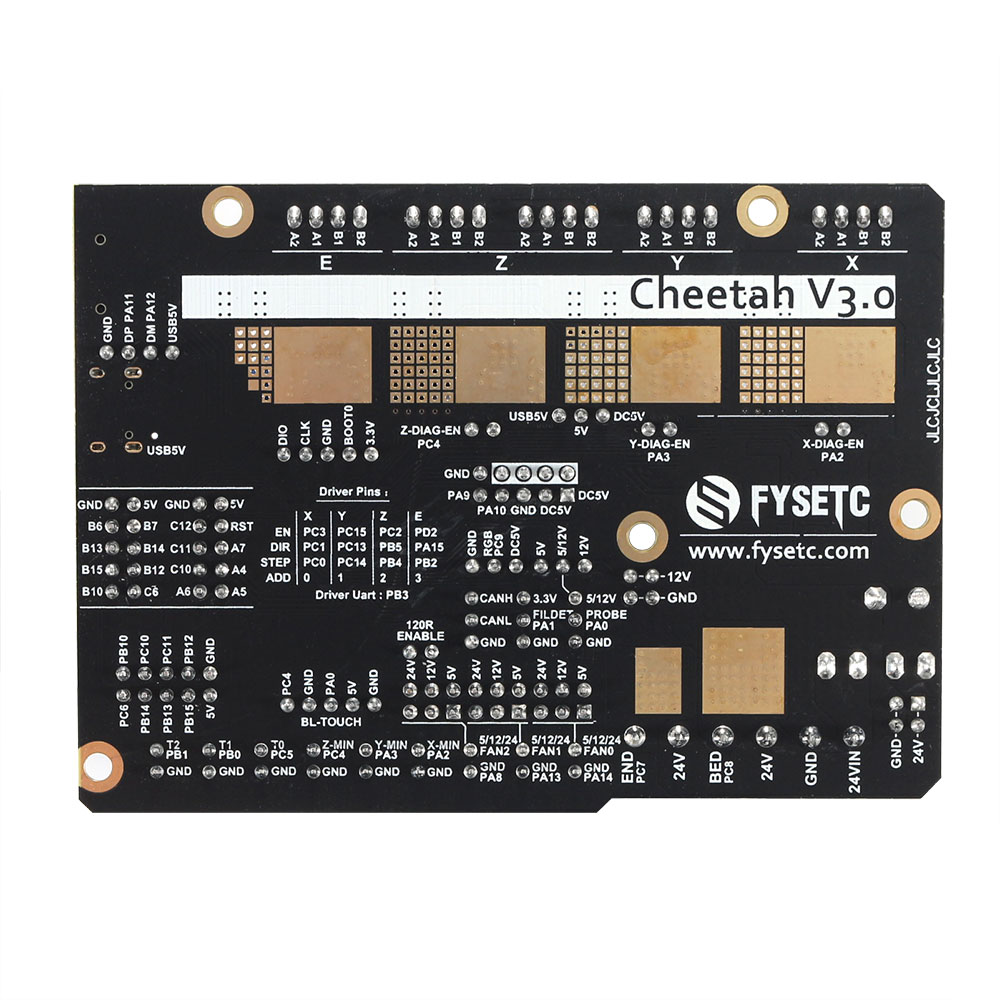

# Cheetah_V3.0

<a href="">

</a>

## 1. Introduction

The redesigned Cheetah uses a 180Mhz master controller to provide higher speed control. At the same time, in order to improve the ease of use, some commonly used interfaces are added, such as Bl-touch, CAN. At the same time, it provides a full 5V power supply to the Raspberry Pi or other SBCs on the small board, which makes it easier to use Klipper, and also retains the support of multiple voltage fans, which is very convenient.

### Change log：

1. The MCU changed : STM32F446RCT6 (180Mhz)

2. Add a reset button

3. Add CAN interface (with transceiver)

4. Add BL-Touch interface (IO multiplexing)

5. Increase the supply current of 5V to power the Raspberry Pi

6. Add 2x5 terminals for connecting to Raspberry Pi, including serial port 1 (PA9, PA10)

7. Each Pin on the back is marked with a definition silk screen

8. All IOs are redistributed, new configuration files are required, incompatible with V2 configurations

9. Remove EXP4

10. 4-layer PCB to improve EMC performance and heat dissipation

## 2. Feature

- Compact size: 101.5mm x 72mm，Compatible with the Creatlity ender 3/ender5 motherboard size

- **Fully integrated all in one solution:**

  - **STM32F446** MCU (Run Marlin 2.0/Klipper )

  - 4X TMC2209 stepper drivers, Support sensor-less homing

- **UNIVERSAL POWER:**

  - 24V to 12V/2A DC-DC for fans

  - Integrated high precision power regulators (DC/DC): **5V** **4****A** Max and 3.3V 800mA Max LDO，

  - 12V&24V power pin out

- Onboard TF card socket

- EXP3 for 12864 display panel (Creality 12864 panel or FYSETC Generic12864)

- EXP1&EXP2 RepRapDiscount SmartController compatible pin header on board

- Onboard 5V WS2812 RGB control

- **Onboard CANBUS Circuit**

- **5-Pin Bltouch Interface**（Share IO with Probe and Z-Min）

- SD card & USB upload support

- Car fuses（15A） for main power input

- Indicates all the name of PINS on the bottom

- Up to 3 ways PWM fans (5/12/24 Optional)

- Reliable PCB: **Four Layers**, TG155 FR4, Plug Hole, Immersion Gold


## 3. Configure the Cheetah Board

Use SSH software to connect to your Raspberry Pi and enter the following command:
```
lsusb
```
You should see the device as shown below:

If not, please go back and check the power supply and wiring of the motherboard to ensure that each power indicator light is on.


Enter the following command to get the board ID:
```
ls /dev/serial/by-id
```
Copy the ID with Crtl+C


Use the browser to enter the IP address of the Raspberry Pi to enter the mainsail interface
Click on MACHINE
Click printer.cfg in the list to enter the editing interface


Replace the ID in the [mcu] section


Click SAVE & RESTART

If it goes well, the system will automatically jump to Dashboard, and you can see the temperature curve

### 3.1 Build Firmware Image


* Login to the Raspberry Pi via ssh
* Run the following:

   ```
   cd ~/klipper
   make clean
   make menuconfig
   ```

* In the menu structure there are a number of items to be selected.
  * Select "Enable extra low-level configuration options"
  * Set the micro-controller architecture is set to `STMicroelectronics STM32`
  * Set the Processor model to `STM32F446`
  * **Many people have been unable to connect to the MCU because of the bootloader problem, so we recommends choosing a mode without a bootloader.**
  * Set the Clock Reference to `12 MHz crystal`
  * Set the Communication interface to `USB (on PA11/PA12)`  

   
   

* Once the configuration is selected, press `q` to exit, and "Yes" when  asked to save the configuration.

* Run the command `make`
* The `make` command, when completed, creates a firmware file **klipper.bin** which is stored in the folder `/home/pi/klipper/out`.  

### 3.2 Firmware Installation

* Requires a USB connection
* Requires the installation of an extra jumper on the Cheetah V3 ( short the 3V3 and BT0)
* Does NOT require a microSD card

1. Power off the Cheetah V3
2. Install a jumper between BT0 and 3V3


3. Connect Cheetah V3 & Pi via USB
4. Power on Cheetah V3
5. From your ssh session, run
    ```
    cd ~/klipper
    ```
    to make sure you are in the correct directory
6. Run 
    ```
     lsusb
    ```
    and find the ID of the DFU device.
    
    
    
7. Run 
    ```
     make flash FLASH_DEVICE=0483:df11
    ```
    In general, the DFU mode of STM32 is this ID, if not, replacing 0483:df11 with the ID from the previous step
 8. If everything goes well, you will see the words SUCCESSFUL.
  
    
    
 9. Power off the Cheetah V3

 10. Move the jumper to BT0 & GND (When the STM32 is turned on, BT0 should be at a low level, and it is also possible to hang it in the air, but in order to avoid unpredictable problems, it is better to short-circuit BT0 and GND here, which is more secure.)

   


 11. Power up the Cheetah V3

 12. You can confirm that the flash was successful by running `ls /dev/serial/by-id`.  If the flash was successful, this should now show a klipper device, similar to:
 
     
  

   (note: this test is not applicable if the firmware was compiled for UART, rather than USB)


**Important:** If the Cheetah V3 is not powered with 12-24V, Klipper will be unable to communicate with the TMC drivers via UART and the Cheetah V3 will automatically shut down.


